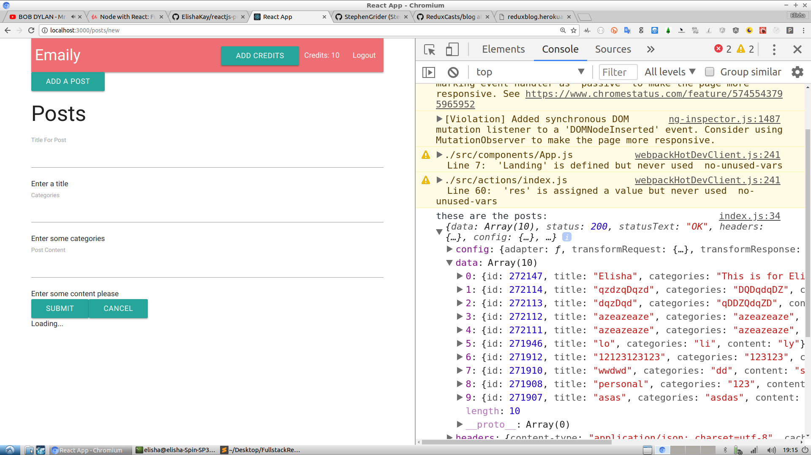
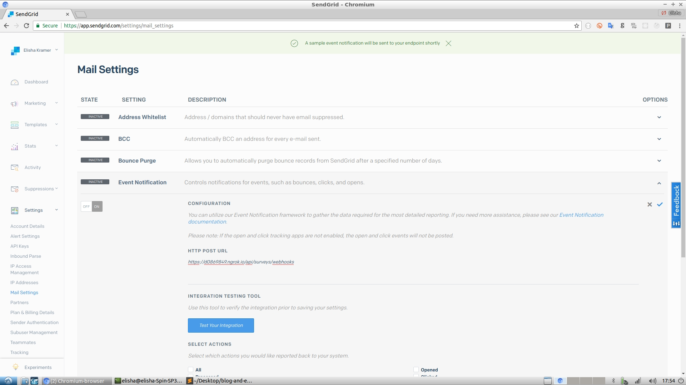

# FullstackReactCode



Based on the repos from two separate Udemy Courses by Stephen Grider:

A) Course #1: https://www.udemy.com/react-redux/

B) Course #2: https://www.udemy.com/node-with-react-fullstack-web-development

The project utilizes Google Oauth 2.0 via NPM's Passport Library. For more information on the Oauth side of this repo, you can view this <a href="https://github.com/ElishaKay/nodejs-passport-google-oauth2">earlier version of the repo</a> along with some of my notes and edits.

<h3>Getting Started</h3>

1. git clone.
2. Npm Install dependencies both in the 'server' and 'client' folder.
3. When located in the 'server' directory, Run 'npm run dev' - this should start ReactJS on 'localhost:3000' and the NodeJS server on 'localhost:5000'. 

```During Development:``` there is a 'proxy' within the 'client' folder's package.json that automatically routes server requests to the right place (localhost:5000), 

```During Deployment:``` webpack is deployed to heroku and the optimized build is set when you deploy your repo to heroku. You will still need to set environment vars via Heroku (easy to do via the Admin Dashboard)

3. Within the file 'server/sendgrid_webhook.sh', change 'moochypoochy21948' to any unique string. This is called a subdomain and you need it for NPM's 'localtunnel' library.

4. Within your 'client' folder, you'll see 2 files ".env.development" and '.env.production' - these are your 'publishable' Stripe keys. It's important that they correspond to the keys you set on your server.

If you're running on Linux, here's what you need to paste into your CLI:

```
export GOOGLE_CLIENT_ID=xyz
export GOOGLE_CLIENT_SECRET=xyz
export MONGO_URI=you-can-get-it-at-mlab.com
export COOKIE_KEY=125876586534-you-can-make-this-up
export STRIPE_PUBLISHABLE_KEY=get-from-stripe(same-as-client-key)
export STRIPE_SECRET_KEY=get-from-stripe
export SEND_GRID_KEY=get-from-sendgrid
export REDIRECT_DOMAIN=localhost:3000
```

<h4>Testing The SendGrid Webhooks API locally</h4>

The project uses ngrok, which is listed as an npm package on the server. This allows sendgrid to send post requests to our local computer. Here's how to set it up:

Step 1: Once the server is running, navigate within your browser to: http://127.0.0.1:4040/inspect/http

You will see 2 links provided to you by ngrok (1 http and 1 https). Copy that link and follow step 2.

Step 2: Within Sendgrid, <a href="https://app.sendgrid.com/settings/mail_settings">navigate to this screen</a>, and input the link that Ngrok provides you:



Step 3: Press 'Test Your Integration'.

Step 4: Back in your ngrok dashboard (http://127.0.0.1:4040/inspect/http), you'll see a post request that just came in from Sendgrid. Congrats, the communication has begun.